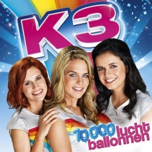
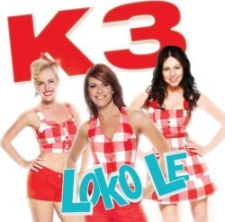

# K3Reviews

Reviews of all K3 songs by adult K3 fans.

This repository is evolving towards an R package, to do a more thorough analysis.

Here all all CD's, most recent at the top.

# Next CD

 * [Ushuaia](Reviews/Ushuaia.md)

# 10000 Luchtballonnen

 * [01. 10.000 Luchtballonnen](Reviews/10000Luchtballonnen.md)
 * [02. Kusjessoldaten](Reviews/Kusjessoldaten.md)
 * [03. Als het binnenregent](Reviews/AlsHetBinnenRegent.md)
 * [04. Jodelee](Reviews/Jodelee.md)
 * [05. Kus van de juf](Reviews/KusVanDeJuf.md)
 * [06. Jij bent de bom!](Reviews/JijBentDeBom.md)
 * [07. Rettettet](Reviews/Rettettet.md)
 * [08. Lila liedjesland](Reviews/LilaLiedjesland.md)
 * [09. Woef!](Reviews/Woef.md)
 * [10. Do do do you love me](Reviews/DoDoDoYouLoveMe.md)
 * [11. Mami Bisou](Reviews/MamiBisou.md)
 * [12. Meisjesdag](Reviews/Meisjesdag.md)

# Loko Le

 * [01. Loko le](Reviews/LokoLe.md)
 * [02. Eya hoya!](Reviews/EyaHoya.md)
 * [03. Viva viool](Reviews/VivaViool.md)
 * [04. Kusje van jou](Reviews/KusjeVanJou.md)
 * [05. Drums gaan boem](Reviews/DrumsGaanBoem.md)
 * [06. En ik dans](Reviews/EnIkDans.md)
 * [07. Alleen door jou](Reviews/AlleenDoorJou.md)
 * [08. Ik wil niet naar huis gaan](Reviews/IkWilNietNaarHuisGaan.md)
 * [09. Het steltenlied](Reviews/HetSteltenlied.md)
 * [10. Wat jij doet met mij](Reviews/WatJijDoetMetMij.md)
 * [11. Kitty](Reviews/Kitty.md)
 * [12. Kinderen baas](Reviews/KinderenBaas.md)
 * [13. Koning Willem-Alexander](Reviews/KoningWillemAlexander.md)

# Engeltjes

 * [01. Waar zijn die engeltjes](Reviews/WaarZijnDieEngeltjes.md)
 * [02. Zeg eens AAA](Reviews/ZegEensAaa.md)
 * [03. Parapluutje](Reviews/Parapluutje.md)
 * [04. Mama kan alles](Reviews/MamaKanAlles.md)
 * [05. Vind ik leuk](Reviews/VindIkLeuk.md)
 * [06. Leugentje leugentje](Reviews/LeugentjeLeugentje.md)
 * [07. Wie zal ik een kusje geven](Reviews/WieZalIkEenKusjeGeven.md)
 * [08. Niet normaal](Reviews/NietNormaal.md)
 * [09. Gigaleuke dag](Reviews/GigaleukeDag.md)
 * [10. Jurkje](Reviews/Jurkje.md)
 * [11. Zwaai als je verliefd bent](Reviews/ZwaaiAlsJeVerliefdBent.md)
 * [12. Mijn liefje achterna](Reviews/MijnLiefjeAchterna.md)

# Eyo!

 * [01 - Eyo!](Reviews/Eyo.md)
 * [02 - Hallo K3](Reviews/HalloK3.md)
 * [03 - Willem-Alexander](Reviews/WillemAlexander.md)
 * [04 - Smoorverliefd](Reviews/Smoorverliefd.md)
 * [05 - K3-Airlines](Reviews/K3Airlines.md)
 * [06 - Beroemd](Reviews/Beroemd.md)
 * [07 - Meiden van de brandweer](Reviews/MeidenVanDeBrandweer.md)
 * [08 - Verstoppertje](Reviews/Verstoppertje.md)
 * [09 - Telepathie](Reviews/Telepathie.md)
 * [10 - Dubbeldekkertrein](Reviews/Dubbeldekkertrein.md)
 * [11 - Bel me ringeling](Reviews/BelMeRingeling.md)
 * [12 - Cowboys en indianen](Reviews/CowboysEnIndianen.md)

# Mamasé!

 * [01. MaMaSe](Reviews/MaMaSe.md)
 * [02. De politie](Reviews/DePolitie.md)
 * [03. Handjes draaien](Reviews/HandjesDraaien.md)
 * [04. Leukste van het land](Reviews/LeuksteVanHetLand.md)
 * [05. Lollypopland](Reviews/Lollypopland.md)
 * [06. De revolutie](Reviews/DeRevolutie.md)
 * [07. Hiep hiep hoera](Reviews/HiepHiepHoera.md)
 * [08. Radio](Reviews/Radio.md)
 * [09. Blankenberge](Reviews/Blankenberge.md)
 * [10. Hey hey](Reviews/HeyHey.md)
 * [11. Ster](Reviews/Ster.md)
 * [12. Wanneer zie ik jou terug](Reviews/WanneerZieIkJouTerug.md)

# Kusjes

 * [01. Kusjesdag](Reviews/Kusjesdag.md)
 * [02. Je mama ziet je graag](Reviews/JeMamaZietJeGraag.md)
 * [03. Billy Billy](Reviews/BillyBilly.md)
 * [04. Sterren](Reviews/Sterren.md)
 * [05. Jongen van mijn dromen](Reviews/JongenVanMijnDromen.md)
 * [06. Ons huis](Reviews/OnsHuis.md)
 * [07. Iedereen op de dansvloer](Reviews/IedereenOpDeDansvloer.md)
 * [08. De wereld veranderen](Reviews/DeWereldVeranderen.md)
 * [09. Sproetje](Reviews/Sproetje.md)
 * [10. Prinses](Reviews/Prinses.md)
 * [11. Vliegen als een vogel](Reviews/VliegenAlsEenVogel.md)
 * [12. Ware liefde](Reviews/WareLiefde.md)

# Ya ya yippee

 * [01. Ya Ya Yippee](Reviews/YaYaYippee.md)
 * [02. Dokter Dokter](Reviews/DokterDokter.md)
 * [03. Trouwen](Reviews/Trouwen.md)
 * [04. Zoo](Reviews/Zoo.md)
 * [05. Eskimo](Reviews/Eskimo.md)
 * [06. Sprookjesbos](Reviews/Sprookjesbos.md)
 * [07. Bibliotheek](Reviews/Bibliotheek.md)
 * [08. Feestje](Reviews/Feestje.md)
 * [09. Op Televisie](Reviews/OpTelevisie.md)
 * [10. Excuseer Me](Reviews/ExcuseerMe.md)
 * [11. Vriendschap](Reviews/Vriendschap.md)
 * [12. Eeny Meeny](Reviews/EenyMeeny.md)

# Kuma he

 * [01 - Kuma he](Reviews/KumaHe.md)
 * [02 - Borst vooruit](Reviews/BorstVooruit.md)
 * [03 - Shakalaka](Reviews/Shakalaka.md)
 * [04 - Antwoordapparaat](Reviews/Antwoordapparaat.md)
 * [05 - Alle baby's](Reviews/AlleBabys.md)
 * [06 - Zonnestraaltje](Reviews/Zonnestraaltje.md)
 * [07 - Eerste kus](Reviews/EersteKus.md)
 * [08 - Lawine](Reviews/Lawine.md)
 * [09 - Duizend deuren](Reviews/DuizendDeuren.md)
 * [10 - Superformidastisch](Reviews/Superformidastisch.md)
 * [11 - Puppy love](Reviews/PuppyLove.md)
 * [12 - Vrij](Reviews/Vrij.md)

# Oya lélé

 * TODO [01 - De Wereld Van K3](Reviews/DeWereldVanK3.md)
 * [02 - Oya Lélé](Reviews/OyaLele.md)
 * TODO [03 - Frans Liedje](Reviews/FransLiedje.md)
 * [04 - Bij Ons Thuis](Reviews/BijOnsThuis.md)
 * TODO [05 - Opa](Reviews/Opa.md)
 * TODO [06 - Hart Verloren](Reviews/HartVerloren.md)
 * TODO [07 - Hey Hallo](Reviews/HeyHallo.md)
 * TODO [08 - Torenhoog](Reviews/Torenhoog.md)
 * TODO [09 - Mr. De President](Reviews/MrDePresident.md)
 * TODO [10 - Dat Ding Dat Je Doet](Reviews/DatDingDatJeDoet.md)
 * TODO [11 - Ik Kan Niet Meer Verder Zonder Jou](Reviews/IkKanNietMeerVerderZonderJou.md)
 * TODO [12 - Hou Me In Je Armen](Reviews/HouMeInJeArmen.md)
 * TODO [13 - De 3 Biggetjes](Reviews/DeDrieBiggetjes.md)

# De wereld rond

 * [01 - Liefdeskapitein](Reviews/Liefdeskapitein.md)
 * [02 - Een Ongelooflijk Idee](Reviews/EenOngelooflijkIdee.md)
 * [03 - Dat Ik Van Je Hou](Reviews/DatIkVanJeHou.md)
 * [04 - Wij Blijven Vrienden](Reviews/WijBlijvenVrienden.md)
 * [05 - Zou Er Iemand Zijn Op Mars](Reviews/ZouErIemandZijnOpMars.md)
 * [06 - Fiesta De Amor](Reviews/FiestaDeAmor.md)
 * [07 - Hakuna Matata](Reviews/HakunaMatata.md)
 * [08 - Rokjes](Reviews/Rokjes.md)
 * [09 - (Ik Wil) Bamba](Reviews/IkWilBamba.md)
 * [10 - Alle Chinezen](Reviews/AlleChinezen.md)
 * [11 - Fiets](Reviews/Fiets.md)
 * [12 - Babouchka](Reviews/Babouchka.md)
 * [13 - Superhero](Reviews/Superhero.md)

# Verliefd

 * TODO [01 - Feest](Reviews/Feest.md)
 * TODO [02 - Papapa](Reviews/Papapa.md)
 * TODO [03 - SMS](Reviews/Sms.md) 	
 * [04 - Verliefd](Reviews/Verliefd.md)
 * TODO [05 - Hollywood](Reviews/Hollywood.md)
 * TODO [06 - Samen feesten](Reviews/SamenFeesten.md)
 * TODO [07 - Als het regent](Reviews/AlsHetRegent.md)
 * TODO [08 - Noodkreet](Reviews/Noodkreet.md)
 * TODO [09 - Beautiful Boy](Reviews/BeautifulBoy.md)
 * TODO [10 - Je doet maar wat](Reviews/JeDoetMaarWat.md)
 * TODO [11 - Letter V](Reviews/LetterV.md)
 * TODO [12 - Happy Birthday](Reviews/HappyBirthday.md)
 * TODO [13 - Eeuwig en altijd](Reviews/EeuwigEnAltijd.md)

# Tele-Romeo 

 * [01 - Tele-Romeo](Reviews/TeleRomeo.md)
 * TODO [02 - Mama's en papa's](Reviews/MamasEnPapas.md)
 * [03 - Keileuke zomer](Reviews/KeileukeZomer.md)
 * TODO [04 - Ali Baba](Reviews/AliBaba.md)
 * [05 - Blijven staan](Reviews/BlijvenStaan.md)
 * TODO [06 - Je hebt een vriend](Reviews/JeHebtEenVriend.md)
 * [07 - Baby Come Back](Reviews/BabyComeBack.md)
 * TODO [08 - Chacha loco](Reviews/ChachaLoco.md)
 * TODO [09 - Hand in hand](Reviews/HandInHand.md)
 * TODO [10 - Jupiter](Reviews/Jupiter.md)
 * TODO [11 - Honingbeer](Reviews/Honingbeer.md)
 * [12 - Iedereen is anders](Reviews/IedereenIsAnders.md)
 * TODO [13 - Blub, ik ben een vis](Reviews/BlubIkBenEenVis.md)

# Alle kleuren

 * [01 - Alle kleuren](Reviews/AlleKleuren.md)
 * [02 - Hippie shake](Reviews/HippieShake.md)
 * [03 - Yippee yippee](Reviews/YippeeYippee.md)
 * [04 - Leonardo](Reviews/Leonardo.md)
 * [05 - Oma's aan de top](Reviews/OmasAanDeTop.md)
 * [06 - 1, 2, doe met me mee](Reviews/12DoeMetMeMee.md)
 * [07 - Miljoen](Reviews/Miljoen.md)
 * [08 - Laat de wind maar waaien](Reviews/LaatDeWindMaarWaaien.md)
 * [09 - Om te dromen](Reviews/OmTeDromen.md)
 * [10 - Ik schreeuw het van de daken](Reviews/IkSchreeuwHetVanDeDaken.md)
 * [11 - Jongens zijn gek](Reviews/JongensZijnGek.md)
 * [12 - Doe maar](Reviews/DoeMaar.md)

CD 2:

 * [01 - Ster aan de hemel](Reviews/SterAanDeHemel.md)
 * [02 - Stapelgek](Reviews/Stapelgek.md)

# Parels 2000

 * TODO [01 - Yeke Yeke](Reviews/YekeYeke.md)
 * [02 - Wat ik wil](Reviews/WatIkWil.md)
 * [03 - Heyah mama](Reviews/HeyahMama.md)
 * TODO [04 - Op elkaar](Reviews/OpElkaar.md)
 * TODO [05 - Parels](Reviews/Parels.md)
 * TODO [06 - I Love You Baby](Reviews/IloveYouBaby.md)
 * TODO [07 - Ik kom tot leven](Reviews/IkKomTotLeven.md)
 * TODO [08 - Altijd van je dromen](Reviews/AltijdVanJeDromen.md)
 * [09 - Geen tweede keer](Reviews/GeenTweedeKeer.md)
 * TODO [10 - Zonder jou](Reviews/ZonderJou.md)
 * TODO [11 - Oh ja](Reviews/OhJa.md)

# Others

# Alice in Wonderland

Part 1

 * [Naar de film](Reviews/NaarDeFilm.md)
 * [Filmster](Reviews/Filmster.md)
 * [Te laat](Reviews/TeLaat.md)
 * [Alles kan in wonderland](Reviews/AllesKanInWonderland.md)
 * [Onder water](Reviews/OnderWater.md)
 * [Op de kermis](Reviews/OpDeKermis.md)
 * [K3-pap](Reviews/K3Pap.md)
 * [Wat een feest](Reviews/WatEenFeest.md)
 * [Niet-verjaardagsfeest](Reviews/NietVerjaardagsfeest.md)

Part 2

 * [Alice in Wonderland](Reviews/AliceInWonderland.md)
 * [De allermooiste vlinder](Reviews/DeAllermooisteVlinder.md)
 * [Hartenkoning-in](Reviews/Hartenkoning-in.md)
 * [Doe de bloemendans](Reviews/DoeDeBloemendans.md)
 * TODO [De kop eraf!](Reviews/DeKopEraf.md)
 * [Ik wil naar huis](Reviews/IkWilNaarHuis.md)
 * [Geloof in jezelf](Reviews/GeloofInJezelf.md)

# Toveren

 * [Toveren](Reviews/Toveren.md)

# K3 en het ijsprinsesje

 * TODO [Trouwen](Reviews/Trouwen.md)
 * TODO [Etiquetterap](Reviews/Etiquetterap.md)
 * TODO [Cake met chocolade](Reviews/CakeMetChocolade.md)
 * TODO [Meisje in de Spiegel](Reviews/MeisjeInDeSpiegel.md)
 * TODO [Betoverd](Reviews/Betoverd.md)

# Other things

 * Read the [FAQ](Reviews/Faq.md)
 * Read [Richel's analysis](Reviews/AnalysisRichel.md)
