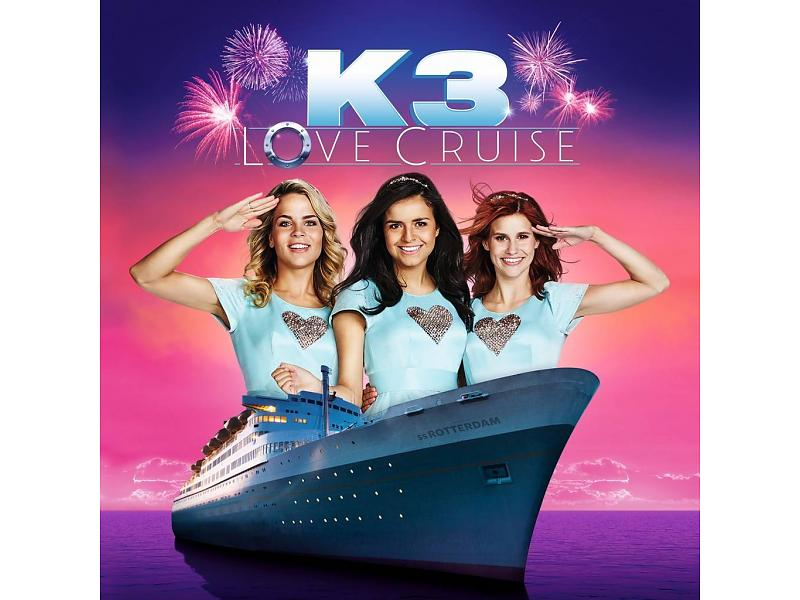
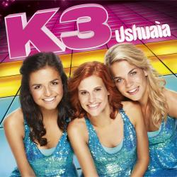
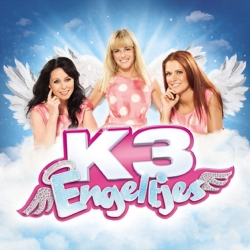
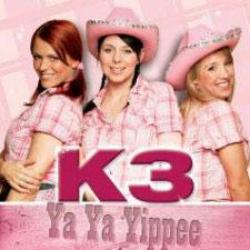
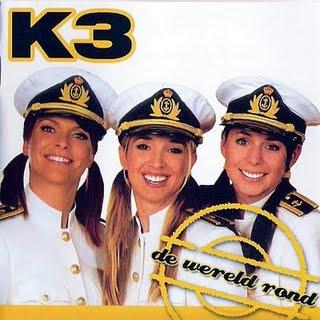

# K3Reviews

Reviews of all K3 songs by adult K3 fans.

This repository is evolving towards an R package, to do a more thorough analysis.

Here all all CD's, most recent at the top.

# [Lovecruise]

 * [01. Pina Colada](PinaColada.md)
 * [02. Liefde Is Overal](LiefdeIsOveral.md)
 * [03. 1000 Kleine Matroosjes](1000KleineMatroosjes.md)
 * [04. Dieper Dan De Zee](DieperDanDeZee.md)
 * [05. Verliefd Zijn](VerliefdZijn.md)
 * [06. Hippie Happy Holiday](HippieHappyHoliday.md)
 * [07. Ik Doe Wat Ik Wil](IkDoeWatIkWil.md)
 * [08. Disco Oma](DiscoOma.md)
 * [09. Meisjes Doen De Wereld Draaien](MeisjesDoenDeWereldDraaien.md)
 * [10. Baby Boe](BabyBoe.md)
 * [11. Pyamaparty](Pyamaparty.md)
 * [12. Verlegen Vlindertje](VerlegenVlindertje.md)

# Ushuaia

 * [01. Ushuaia](Ushuaia.md)
 * [02.	Love Boat Baby](LoveBoatBaby.md)
 * [03.	De Aarde Beeft](DeAardeBeeft.md)
 * [04.	Aliyee](Aliyee.md)
 * [05.	Iedereen K3](IedereenK3.md)
 * [06.	On Va Danser](OnVaDanser.md)
 * [07.	Play-O](PlayO.md)
 * [08.	Boembiboem](Boembiboem.md)
 * [09.	Choco choco](ChocoChoco.md)
 * [10.	Popgroep](Popgroep.md)
 * [11.	Helden en Soldaten](HeldenEnSoldaten.md)
 * [12.	Prinsesje en Superman](PrinsesjeEnSuperman.md)

# 10000 Luchtballonnen

 * [01. 10.000 Luchtballonnen](10000Luchtballonnen.md)
 * [02. Kusjessoldaten](Kusjessoldaten.md)
 * [03. Als het binnenregent](AlsHetBinnenRegent.md)
 * [04. Jodelee](Jodelee.md)
 * [05. Kus van de juf](KusVanDeJuf.md)
 * [06. Jij bent de bom!](JijBentDeBom.md)
 * [07. Rettettet](Rettettet.md)
 * [08. Lila liedjesland](LilaLiedjesland.md)
 * [09. Woef!](Woef.md)
 * [10. Do do do you love me](DoDoDoYouLoveMe.md)
 * [11. Mami Bisou](MamiBisou.md)
 * [12. Meisjesdag](Meisjesdag.md)

# Loko Le

 * [01. Loko le](LokoLe.md)
 * [02. Eya hoya!](EyaHoya.md)
 * [03. Viva viool](VivaViool.md)
 * [04. Kusje van jou](KusjeVanJou.md)
 * [05. Drums gaan boem](DrumsGaanBoem.md)
 * [06. En ik dans](EnIkDans.md)
 * [07. Alleen door jou](AlleenDoorJou.md)
 * [08. Ik wil niet naar huis gaan](IkWilNietNaarHuisGaan.md)
 * [09. Het steltenlied](HetSteltenlied.md)
 * [10. Wat jij doet met mij](WatJijDoetMetMij.md)
 * [11. Kitty](Kitty.md)
 * [12. Kinderen baas](KinderenBaas.md)
 * [13. Koning Willem-Alexander](KoningWillemAlexander.md)

# Engeltjes

 * [01. Waar zijn die engeltjes](WaarZijnDieEngeltjes.md)
 * [02. Zeg eens AAA](ZegEensAaa.md)
 * [03. Parapluutje](Parapluutje.md)
 * [04. Mama kan alles](MamaKanAlles.md)
 * [05. Vind ik leuk](VindIkLeuk.md)
 * [06. Leugentje leugentje](LeugentjeLeugentje.md)
 * [07. Wie zal ik een kusje geven](WieZalIkEenKusjeGeven.md)
 * [08. Niet normaal](NietNormaal.md)
 * [09. Gigaleuke dag](GigaleukeDag.md)
 * [10. Jurkje](Jurkje.md)
 * [11. Zwaai als je verliefd bent](ZwaaiAlsJeVerliefdBent.md)
 * [12. Mijn liefje achterna](MijnLiefjeAchterna.md)

# Eyo!

 * [01 - Eyo!](Eyo.md)
 * [02 - Hallo K3](HalloK3.md)
 * [03 - Willem-Alexander](WillemAlexander.md)
 * [04 - Smoorverliefd](Smoorverliefd.md)
 * [05 - K3-Airlines](K3Airlines.md)
 * [06 - Beroemd](Beroemd.md)
 * [07 - Meiden van de brandweer](MeidenVanDeBrandweer.md)
 * [08 - Verstoppertje](Verstoppertje.md)
 * [09 - Telepathie](Telepathie.md)
 * [10 - Dubbeldekkertrein](Dubbeldekkertrein.md)
 * [11 - Bel me ringeling](BelMeRingeling.md)
 * [12 - Cowboys en indianen](CowboysEnIndianen.md)

# Mamasé!

 * [01. MaMaSe](MaMaSe.md)
 * [02. De politie](DePolitie.md)
 * [03. Handjes draaien](HandjesDraaien.md)
 * [04. Leukste van het land](LeuksteVanHetLand.md)
 * [05. Lollypopland](Lollypopland.md)
 * [06. De revolutie](DeRevolutie.md)
 * [07. Hiep hiep hoera](HiepHiepHoera.md)
 * [08. Radio](Radio.md)
 * [09. Blankenberge](Blankenberge.md)
 * [10. Hey hey](HeyHey.md)
 * [11. Ster](Ster.md)
 * [12. Wanneer zie ik jou terug](WanneerZieIkJouTerug.md)

# Kusjes

 * [01. Kusjesdag](Kusjesdag.md)
 * [02. Je mama ziet je graag](JeMamaZietJeGraag.md)
 * [03. Billy Billy](BillyBilly.md)
 * [04. Sterren](Sterren.md)
 * [05. Jongen van mijn dromen](JongenVanMijnDromen.md)
 * [06. Ons huis](OnsHuis.md)
 * [07. Iedereen op de dansvloer](IedereenOpDeDansvloer.md)
 * [08. De wereld veranderen](DeWereldVeranderen.md)
 * [09. Sproetje](Sproetje.md)
 * [10. Prinses](Prinses.md)
 * [11. Vliegen als een vogel](VliegenAlsEenVogel.md)
 * [12. Ware liefde](WareLiefde.md)

# Ya Ya Yippee

 * [01. Ya Ya Yippee](YaYaYippee.md)
 * [02. Dokter Dokter](DokterDokter.md)
 * [03. Trouwen](Trouwen.md)
 * [04. Zoo](Zoo.md)
 * [05. Eskimo](Eskimo.md)
 * [06. Sprookjesbos](Sprookjesbos.md)
 * [07. Bibliotheek](Bibliotheek.md)
 * [08. Feestje](Feestje.md)
 * [09. Op Televisie](OpTelevisie.md)
 * [10. Excuseer Me](ExcuseerMe.md)
 * [11. Vriendschap](Vriendschap.md)
 * [12. Eeny Meeny](EenyMeeny.md)

# Kuma he

 * [01 - Kuma he](KumaHe.md)
 * [02 - Borst vooruit](BorstVooruit.md)
 * [03 - Shakalaka](Shakalaka.md)
 * [04 - Antwoordapparaat](Antwoordapparaat.md)
 * [05 - Alle baby's](AlleBabys.md)
 * [06 - Zonnestraaltje](Zonnestraaltje.md)
 * [07 - Eerste kus](EersteKus.md)
 * [08 - Lawine](Lawine.md)
 * [09 - Duizend deuren](DuizendDeuren.md)
 * [10 - Superformidastisch](Superformidastisch.md)
 * [11 - Puppy love](PuppyLove.md)
 * [12 - Vrij](Vrij.md)

# Oya lélé

 * [01 - De Wereld Van K3](DeWereldVanK3.md)
 * [02 - Oya Lélé](OyaLele.md)
 * [03 - Frans Liedje](FransLiedje.md)
 * [04 - Bij Ons Thuis](BijOnsThuis.md)
 * [05 - Opa](Opa.md)
 * [06 - Hart Verloren](HartVerloren.md)
 * [07 - Hey Hallo](HeyHallo.md)
 * [08 - Torenhoog](Torenhoog.md)
 * [09 - Mr. De President](MrDePresident.md)
 * [10 - Dat Ding Dat Je Doet](DatDingDatJeDoet.md)
 * [11 - Ik Kan Niet Meer Verder Zonder Jou](IkKanNietMeerVerderZonderJou.md)
 * [12 - Hou Me In Je Armen](HouMeInJeArmen.md)
 * [13 - De 3 Biggetjes](DeDrieBiggetjes.md)

# De Wereld Rond

 * [01 - Liefdeskapitein](Liefdeskapitein.md)
 * [02 - Een Ongelooflijk Idee](EenOngelooflijkIdee.md)
 * [03 - Dat Ik Van Je Hou](DatIkVanJeHou.md)
 * [04 - Wij Blijven Vrienden](WijBlijvenVrienden.md)
 * [05 - Zou Er Iemand Zijn Op Mars](ZouErIemandZijnOpMars.md)
 * [06 - Fiesta De Amor](FiestaDeAmor.md)
 * [07 - Hakuna Matata](HakunaMatata.md)
 * [08 - Rokjes](Rokjes.md)
 * [09 - (Ik Wil) Bamba](IkWilBamba.md)
 * [10 - Alle Chinezen](AlleChinezen.md)
 * [11 - Fiets](Fiets.md)
 * [12 - Babouchka](Babouchka.md)
 * [13 - Superhero](Superhero.md)

# Verliefd

 * [01 - Feest](Feest.md)
 * [02 - Papapa](Papapa.md)
 * [03 - SMS](Sms.md) 	
 * [04 - Verliefd](Verliefd.md)
 * [05 - Hollywood](Hollywood.md)
 * [06 - Samen feesten](SamenFeesten.md)
 * [07 - Als het regent](AlsHetRegent.md)
 * [08 - Noodkreet](Noodkreet.md)
 * [09 - Beautiful Boy](BeautifulBoy.md)
 * [10 - Je doet maar wat](JeDoetMaarWat.md)
 * [11 - Letter V](LetterV.md)
 * [12 - Happy Birthday](HappyBirthday.md)
 * [13 - Eeuwig en altijd](EeuwigEnAltijd.md)

# Tele-Romeo 

 * [01 - Tele-Romeo](TeleRomeo.md)
 * [02 - Mama's en papa's](MamasEnPapas.md)
 * [03 - Keileuke zomer](KeileukeZomer.md)
 * [04 - Ali Baba](AliBaba.md)
 * [05 - Blijven staan](BlijvenStaan.md)
 * [06 - Je hebt een vriend](JeHebtEenVriend.md)
 * [07 - Baby Come Back](BabyComeBack.md)
 * [08 - Chacha loco](ChachaLoco.md)
 * [09 - Hand in hand](HandInHand.md)
 * [10 - Jupiter](Jupiter.md)
 * [11 - Honingbeer](Honingbeer.md)
 * [12 - Iedereen is anders](IedereenIsAnders.md)
 * [13 - Blub, ik ben een vis](BlubIkBenEenVis.md)

# Alle kleuren

 * [01 - Alle kleuren](AlleKleuren.md)
 * [02 - Hippie shake](HippieShake.md)
 * [03 - Yippee yippee](YippeeYippee.md)
 * [04 - Leonardo](Leonardo.md)
 * [05 - Oma's aan de top](OmasAanDeTop.md)
 * [06 - 1, 2, doe met me mee](12DoeMetMeMee.md)
 * [07 - Miljoen](Miljoen.md)
 * [08 - Laat de wind maar waaien](LaatDeWindMaarWaaien.md)
 * [09 - Om te dromen](OmTeDromen.md)
 * [10 - Ik schreeuw het van de daken](IkSchreeuwHetVanDeDaken.md)
 * [11 - Jongens zijn gek](JongensZijnGek.md)
 * [12 - Doe maar](DoeMaar.md)

CD 2:

 * [01 - Ster aan de hemel](SterAanDeHemel.md)
 * [02 - Stapelgek](Stapelgek.md)

# Parels 2000

 * [01 - Yeke Yeke](YekeYeke.md)
 * [02 - Wat ik wil](WatIkWil.md)
 * [03 - Heyah mama](HeyahMama.md)
 * [04 - Op elkaar](OpElkaar.md)
 * [05 - Parels](Parels.md)
 * [06 - I Love You Baby](IloveYouBaby.md)
 * [07 - Ik kom tot leven](IkKomTotLeven.md)
 * [08 - Altijd van je dromen](AltijdVanJeDromen.md)
 * [09 - Geen tweede keer](GeenTweedeKeer.md)
 * [10 - Zonder jou](ZonderJou.md)
 * [11 - Oh ja](OhJa.md)

# Others

# Alice in Wonderland

Part 1

 * [Naar de film](NaarDeFilm.md)
 * [Filmster](Filmster.md)
 * [Te laat](TeLaat.md)
 * [Alles kan in wonderland](AllesKanInWonderland.md)
 * [Onder water](OnderWater.md)
 * [Op de kermis](OpDeKermis.md)
 * [K3-pap](K3Pap.md)
 * [Wat een feest](WatEenFeest.md)
 * [Niet-verjaardagsfeest](NietVerjaardagsfeest.md)

Part 2

 * [Alice in Wonderland](AliceInWonderland.md)
 * [De allermooiste vlinder](DeAllermooisteVlinder.md)
 * [Hartenkoning-in](Hartenkoning-in.md)
 * [Doe de bloemendans](DoeDeBloemendans.md)
 * [Ik wil naar huis](IkWilNaarHuis.md)
 * [Geloof in jezelf](GeloofInJezelf.md)

# Toveren

 * [Toveren](Toveren.md)

# K3 en het ijsprinsesje

 * [Trouwen](Trouwen.md)
 * TODO [Etiquetterap](Etiquetterap.md)
 * TODO [Cake met chocolade](CakeMetChocolade.md)
 * [Meisje in de Spiegel](MeisjeInDeSpiegel.md)
 * TODO [Betoverd](Betoverd.md)

# Other things

 * Read the [FAQ](Faq.md)
 * Read [Richel's analysis](AnalysisRichel.md)
