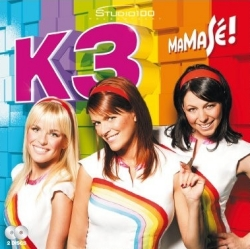
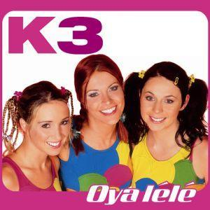
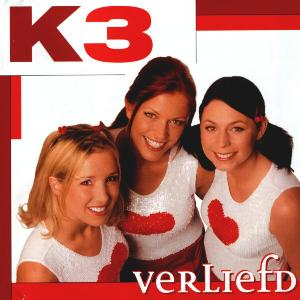

# K3Reviews

Reviews of all K3 songs by adult K3 fans.

This repository is evolving towards an R package, to do a more thorough analysis.

Here all all CD's, most recent at the top.

# Next CD

 * [Ushuaia](inst/extdata/Ushuaia.md)

# 10000 Luchtballonnen

 * [01. 10.000 Luchtballonnen](inst/extdata/10000Luchtballonnen.md)
 * [02. Kusjessoldaten](inst/extdata/Kusjessoldaten.md)
 * [03. Als het binnenregent](inst/extdata/AlsHetBinnenRegent.md)
 * [04. Jodelee](inst/extdata/Jodelee.md)
 * [05. Kus van de juf](inst/extdata/KusVanDeJuf.md)
 * [06. Jij bent de bom!](inst/extdata/JijBentDeBom.md)
 * [07. Rettettet](inst/extdata/Rettettet.md)
 * [08. Lila liedjesland](inst/extdata/LilaLiedjesland.md)
 * [09. Woef!](inst/extdata/Woef.md)
 * [10. Do do do you love me](inst/extdata/DoDoDoYouLoveMe.md)
 * [11. Mami Bisou](inst/extdata/MamiBisou.md)
 * [12. Meisjesdag](inst/extdata/Meisjesdag.md)

# Loko Le

 * [01. Loko le](inst/extdata/LokoLe.md)
 * [02. Eya hoya!](inst/extdata/EyaHoya.md)
 * [03. Viva viool](inst/extdata/VivaViool.md)
 * [04. Kusje van jou](inst/extdata/KusjeVanJou.md)
 * [05. Drums gaan boem](inst/extdata/DrumsGaanBoem.md)
 * [06. En ik dans](inst/extdata/EnIkDans.md)
 * [07. Alleen door jou](inst/extdata/AlleenDoorJou.md)
 * [08. Ik wil niet naar huis gaan](inst/extdata/IkWilNietNaarHuisGaan.md)
 * [09. Het steltenlied](inst/extdata/HetSteltenlied.md)
 * [10. Wat jij doet met mij](inst/extdata/WatJijDoetMetMij.md)
 * [11. Kitty](inst/extdata/Kitty.md)
 * [12. Kinderen baas](inst/extdata/KinderenBaas.md)
 * [13. Koning Willem-Alexander](inst/extdata/KoningWillemAlexander.md)

# Engeltjes

 * [01. Waar zijn die engeltjes](inst/extdata/WaarZijnDieEngeltjes.md)
 * [02. Zeg eens AAA](inst/extdata/ZegEensAaa.md)
 * [03. Parapluutje](inst/extdata/Parapluutje.md)
 * [04. Mama kan alles](inst/extdata/MamaKanAlles.md)
 * [05. Vind ik leuk](inst/extdata/VindIkLeuk.md)
 * [06. Leugentje leugentje](inst/extdata/LeugentjeLeugentje.md)
 * [07. Wie zal ik een kusje geven](inst/extdata/WieZalIkEenKusjeGeven.md)
 * [08. Niet normaal](inst/extdata/NietNormaal.md)
 * [09. Gigaleuke dag](inst/extdata/GigaleukeDag.md)
 * [10. Jurkje](inst/extdata/Jurkje.md)
 * [11. Zwaai als je verliefd bent](inst/extdata/ZwaaiAlsJeVerliefdBent.md)
 * [12. Mijn liefje achterna](inst/extdata/MijnLiefjeAchterna.md)

# Eyo!

 * [01 - Eyo!](inst/extdata/Eyo.md)
 * [02 - Hallo K3](inst/extdata/HalloK3.md)
 * [03 - Willem-Alexander](inst/extdata/WillemAlexander.md)
 * [04 - Smoorverliefd](inst/extdata/Smoorverliefd.md)
 * [05 - K3-Airlines](inst/extdata/K3Airlines.md)
 * [06 - Beroemd](inst/extdata/Beroemd.md)
 * [07 - Meiden van de brandweer](inst/extdata/MeidenVanDeBrandweer.md)
 * [08 - Verstoppertje](inst/extdata/Verstoppertje.md)
 * [09 - Telepathie](inst/extdata/Telepathie.md)
 * [10 - Dubbeldekkertrein](inst/extdata/Dubbeldekkertrein.md)
 * [11 - Bel me ringeling](inst/extdata/BelMeRingeling.md)
 * [12 - Cowboys en indianen](inst/extdata/CowboysEnIndianen.md)

# Mamasé!

 * [01. MaMaSe](inst/extdata/MaMaSe.md)
 * [02. De politie](inst/extdata/DePolitie.md)
 * [03. Handjes draaien](inst/extdata/HandjesDraaien.md)
 * [04. Leukste van het land](inst/extdata/LeuksteVanHetLand.md)
 * [05. Lollypopland](inst/extdata/Lollypopland.md)
 * [06. De revolutie](inst/extdata/DeRevolutie.md)
 * [07. Hiep hiep hoera](inst/extdata/HiepHiepHoera.md)
 * [08. Radio](inst/extdata/Radio.md)
 * [09. Blankenberge](inst/extdata/Blankenberge.md)
 * [10. Hey hey](inst/extdata/HeyHey.md)
 * [11. Ster](inst/extdata/Ster.md)
 * [12. Wanneer zie ik jou terug](inst/extdata/WanneerZieIkJouTerug.md)

# Kusjes

 * [01. Kusjesdag](inst/extdata/Kusjesdag.md)
 * [02. Je mama ziet je graag](inst/extdata/JeMamaZietJeGraag.md)
 * [03. Billy Billy](inst/extdata/BillyBilly.md)
 * [04. Sterren](inst/extdata/Sterren.md)
 * [05. Jongen van mijn dromen](inst/extdata/JongenVanMijnDromen.md)
 * [06. Ons huis](inst/extdata/OnsHuis.md)
 * [07. Iedereen op de dansvloer](inst/extdata/IedereenOpDeDansvloer.md)
 * [08. De wereld veranderen](inst/extdata/DeWereldVeranderen.md)
 * [09. Sproetje](inst/extdata/Sproetje.md)
 * [10. Prinses](inst/extdata/Prinses.md)
 * [11. Vliegen als een vogel](inst/extdata/VliegenAlsEenVogel.md)
 * [12. Ware liefde](inst/extdata/WareLiefde.md)

# Ya Ya Yippee

 * [01. Ya Ya Yippee](inst/extdata/YaYaYippee.md)
 * [02. Dokter Dokter](inst/extdata/DokterDokter.md)
 * [03. Trouwen](inst/extdata/Trouwen.md)
 * [04. Zoo](inst/extdata/Zoo.md)
 * [05. Eskimo](inst/extdata/Eskimo.md)
 * [06. Sprookjesbos](inst/extdata/Sprookjesbos.md)
 * [07. Bibliotheek](inst/extdata/Bibliotheek.md)
 * [08. Feestje](inst/extdata/Feestje.md)
 * [09. Op Televisie](inst/extdata/OpTelevisie.md)
 * [10. Excuseer Me](inst/extdata/ExcuseerMe.md)
 * [11. Vriendschap](inst/extdata/Vriendschap.md)
 * [12. Eeny Meeny](inst/extdata/EenyMeeny.md)

# Kuma he

 * [01 - Kuma he](inst/extdata/KumaHe.md)
 * [02 - Borst vooruit](inst/extdata/BorstVooruit.md)
 * [03 - Shakalaka](inst/extdata/Shakalaka.md)
 * [04 - Antwoordapparaat](inst/extdata/Antwoordapparaat.md)
 * [05 - Alle baby's](inst/extdata/AlleBabys.md)
 * [06 - Zonnestraaltje](inst/extdata/Zonnestraaltje.md)
 * [07 - Eerste kus](inst/extdata/EersteKus.md)
 * [08 - Lawine](inst/extdata/Lawine.md)
 * [09 - Duizend deuren](inst/extdata/DuizendDeuren.md)
 * [10 - Superformidastisch](inst/extdata/Superformidastisch.md)
 * [11 - Puppy love](inst/extdata/PuppyLove.md)
 * [12 - Vrij](inst/extdata/Vrij.md)

# Oya lélé

 * [01 - De Wereld Van K3](inst/extdata/DeWereldVanK3.md)
 * [02 - Oya Lélé](inst/extdata/OyaLele.md)
 * [03 - Frans Liedje](inst/extdata/FransLiedje.md)
 * [04 - Bij Ons Thuis](inst/extdata/BijOnsThuis.md)
 * [05 - Opa](inst/extdata/Opa.md)
 * [06 - Hart Verloren](inst/extdata/HartVerloren.md)
 * [07 - Hey Hallo](inst/extdata/HeyHallo.md)
 * [08 - Torenhoog](inst/extdata/Torenhoog.md)
 * [09 - Mr. De President](inst/extdata/MrDePresident.md)
 * [10 - Dat Ding Dat Je Doet](inst/extdata/DatDingDatJeDoet.md)
 * [11 - Ik Kan Niet Meer Verder Zonder Jou](inst/extdata/IkKanNietMeerVerderZonderJou.md)
 * [12 - Hou Me In Je Armen](inst/extdata/HouMeInJeArmen.md)
 * [13 - De 3 Biggetjes](inst/extdata/DeDrieBiggetjes.md)

# De Wereld Rond

 * [01 - Liefdeskapitein](inst/extdata/Liefdeskapitein.md)
 * [02 - Een Ongelooflijk Idee](inst/extdata/EenOngelooflijkIdee.md)
 * [03 - Dat Ik Van Je Hou](inst/extdata/DatIkVanJeHou.md)
 * [04 - Wij Blijven Vrienden](inst/extdata/WijBlijvenVrienden.md)
 * [05 - Zou Er Iemand Zijn Op Mars](inst/extdata/ZouErIemandZijnOpMars.md)
 * [06 - Fiesta De Amor](inst/extdata/FiestaDeAmor.md)
 * [07 - Hakuna Matata](inst/extdata/HakunaMatata.md)
 * [08 - Rokjes](inst/extdata/Rokjes.md)
 * [09 - (Ik Wil) Bamba](inst/extdata/IkWilBamba.md)
 * [10 - Alle Chinezen](inst/extdata/AlleChinezen.md)
 * [11 - Fiets](inst/extdata/Fiets.md)
 * [12 - Babouchka](inst/extdata/Babouchka.md)
 * [13 - Superhero](inst/extdata/Superhero.md)

# Verliefd

 * [01 - Feest](inst/extdata/Feest.md)
 * [02 - Papapa](inst/extdata/Papapa.md)
 * [03 - SMS](inst/extdata/Sms.md) 	
 * [04 - Verliefd](inst/extdata/Verliefd.md)
 * [05 - Hollywood](inst/extdata/Hollywood.md)
 * [06 - Samen feesten](inst/extdata/SamenFeesten.md)
 * [07 - Als het regent](inst/extdata/AlsHetRegent.md)
 * [08 - Noodkreet](inst/extdata/Noodkreet.md)
 * [09 - Beautiful Boy](inst/extdata/BeautifulBoy.md)
 * [10 - Je doet maar wat](inst/extdata/JeDoetMaarWat.md)
 * [11 - Letter V](inst/extdata/LetterV.md)
 * [12 - Happy Birthday](inst/extdata/HappyBirthday.md)
 * [13 - Eeuwig en altijd](inst/extdata/EeuwigEnAltijd.md)

# Tele-Romeo 

 * [01 - Tele-Romeo](inst/extdata/TeleRomeo.md)
 * [02 - Mama's en papa's](inst/extdata/MamasEnPapas.md)
 * [03 - Keileuke zomer](inst/extdata/KeileukeZomer.md)
 * [04 - Ali Baba](inst/extdata/AliBaba.md)
 * [05 - Blijven staan](inst/extdata/BlijvenStaan.md)
 * [06 - Je hebt een vriend](inst/extdata/JeHebtEenVriend.md)
 * [07 - Baby Come Back](inst/extdata/BabyComeBack.md)
 * [08 - Chacha loco](inst/extdata/ChachaLoco.md)
 * TODO [09 - Hand in hand](inst/extdata/HandInHand.md)
 * TODO [10 - Jupiter](inst/extdata/Jupiter.md)
 * TODO [11 - Honingbeer](inst/extdata/Honingbeer.md)
 * [12 - Iedereen is anders](inst/extdata/IedereenIsAnders.md)
 * TODO [13 - Blub, ik ben een vis](inst/extdata/BlubIkBenEenVis.md)

# Alle kleuren

 * [01 - Alle kleuren](inst/extdata/AlleKleuren.md)
 * [02 - Hippie shake](inst/extdata/HippieShake.md)
 * [03 - Yippee yippee](inst/extdata/YippeeYippee.md)
 * [04 - Leonardo](inst/extdata/Leonardo.md)
 * [05 - Oma's aan de top](inst/extdata/OmasAanDeTop.md)
 * [06 - 1, 2, doe met me mee](inst/extdata/12DoeMetMeMee.md)
 * [07 - Miljoen](inst/extdata/Miljoen.md)
 * [08 - Laat de wind maar waaien](inst/extdata/LaatDeWindMaarWaaien.md)
 * [09 - Om te dromen](inst/extdata/OmTeDromen.md)
 * [10 - Ik schreeuw het van de daken](inst/extdata/IkSchreeuwHetVanDeDaken.md)
 * [11 - Jongens zijn gek](inst/extdata/JongensZijnGek.md)
 * [12 - Doe maar](inst/extdata/DoeMaar.md)

CD 2:

 * [01 - Ster aan de hemel](inst/extdata/SterAanDeHemel.md)
 * [02 - Stapelgek](inst/extdata/Stapelgek.md)

# Parels 2000

 * TODO [01 - Yeke Yeke](inst/extdata/YekeYeke.md)
 * [02 - Wat ik wil](inst/extdata/WatIkWil.md)
 * [03 - Heyah mama](inst/extdata/HeyahMama.md)
 * TODO [04 - Op elkaar](inst/extdata/OpElkaar.md)
 * TODO [05 - Parels](inst/extdata/Parels.md)
 * TODO [06 - I Love You Baby](inst/extdata/IloveYouBaby.md)
 * TODO [07 - Ik kom tot leven](inst/extdata/IkKomTotLeven.md)
 * TODO [08 - Altijd van je dromen](inst/extdata/AltijdVanJeDromen.md)
 * [09 - Geen tweede keer](inst/extdata/GeenTweedeKeer.md)
 * TODO [10 - Zonder jou](inst/extdata/ZonderJou.md)
 * TODO [11 - Oh ja](inst/extdata/OhJa.md)

# Others

# Alice in Wonderland

Part 1

 * [Naar de film](inst/extdata/NaarDeFilm.md)
 * [Filmster](inst/extdata/Filmster.md)
 * [Te laat](inst/extdata/TeLaat.md)
 * [Alles kan in wonderland](inst/extdata/AllesKanInWonderland.md)
 * [Onder water](inst/extdata/OnderWater.md)
 * [Op de kermis](inst/extdata/OpDeKermis.md)
 * [K3-pap](inst/extdata/K3Pap.md)
 * [Wat een feest](inst/extdata/WatEenFeest.md)
 * [Niet-verjaardagsfeest](inst/extdata/NietVerjaardagsfeest.md)

Part 2

 * [Alice in Wonderland](inst/extdata/AliceInWonderland.md)
 * [De allermooiste vlinder](inst/extdata/DeAllermooisteVlinder.md)
 * [Hartenkoning-in](inst/extdata/Hartenkoning-in.md)
 * [Doe de bloemendans](inst/extdata/DoeDeBloemendans.md)
 * TODO [De kop eraf!](inst/extdata/DeKopEraf.md)
 * [Ik wil naar huis](inst/extdata/IkWilNaarHuis.md)
 * [Geloof in jezelf](inst/extdata/GeloofInJezelf.md)

# Toveren

 * [Toveren](inst/extdata/Toveren.md)

# K3 en het ijsprinsesje

 * TODO [Trouwen](inst/extdata/Trouwen.md)
 * TODO [Etiquetterap](inst/extdata/Etiquetterap.md)
 * TODO [Cake met chocolade](inst/extdata/CakeMetChocolade.md)
 * TODO [Meisje in de Spiegel](inst/extdata/MeisjeInDeSpiegel.md)
 * TODO [Betoverd](inst/extdata/Betoverd.md)

# Other things

 * Read the [FAQ](inst/extdata/Faq.md)
 * Read [Richel's analysis](inst/extdata/AnalysisRichel.md)
